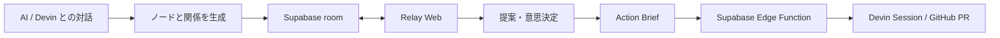

# Dialogue Atlas Relay

Dialogue Atlas Relay は、AI との対話を、チームで編集・検証・実行できる意思決定の星図へ変換する Web アプリです。

- 星図：対話から生まれた論点、関係、決定、タスクを可視化
- 共同作業：ルーム管理、リアルタイム編集、提案と意思決定
- Devin：対話、タスク実行、進捗、成果物、PR を同じ画面で管理
- Supabase：認証、データ永続化、RLS、Realtime、Presence、Edge Function

公開するノードと根拠は、ルームオーナーが選択します。

## デモ

1. Web で AI との対話を開始し、ルームを作成する。
2. 対話の一まとまりをノードとして星図に追加する。
3. メンバーが招待リンクから参加し、同じ星図を編集する。
4. 主張、関係、スタンス、コメント、提案をリアルタイムで共有する。
5. オーナーが提案を承認し、Action Brief にまとめる。
6. Devin Session を開始し、進捗、イベント、PR を星図上で確認する。

## アーキテクチャ



```text
apps/relay-web/              Vercel Web アプリ
packages/atlas-graph/        星図レンダラー
packages/relay-contract/     公開 DTO と validation
packages/relay-room/         ルーム UI と state controller
packages/relay-supabase/     Supabase / Realtime adapter
supabase/                    schema、RLS、RPC、pgTAP、Edge Function
```

詳細：[Relay architecture](docs/relay-architecture.md) / [privacy contract](docs/relay-privacy.md)

## データと権限

Supabase は room、member、node、relation、stance、proposal、decision、layout、Devin run / event を保存します。RLS は room membership と owner 権限を各操作で検証します。

ルーム内では次の規則を適用します。

- 公開済み source layer は不変
- メンバーは自分の team node / relation を編集可能
- Source と他メンバーの変更は proposal 経由
- Confirm、challenge、needs-evidence はメンバーごとに保持
- Proposal の決定、ルーム終了、Devin 開始はオーナーのみ
- Durable mutation は Postgres、カーソル・typing・drag preview は Realtime
- Layout と team item は revision compare-and-swap

Anonymous Auth のユーザーも `authenticated` role として RLS の対象になります。招待 token は room membership を付与します。

## Devin 連携

オーナーが承認した Action Brief から Devin Session を作成します。ブラウザから送る値は `roomId`、`actionBriefId`、idempotency key です。Edge Function が承認内容を再取得し、repository、baseline SHA、変更可能ファイル、検証コマンド、ACU 上限を固定します。

Canonical repository：`visiontale7-svg/AIAU-Salary-neko`

Devin の状態、イベント、Session URL、PR URL を Relay に保存して表示します。Provider message は保存前にサニタイズし、PR URL は canonical repository に限定します。オーナーの follow-up は room member に共有されます。

Devin を開始するには、room owner の権限に加えて `relay_private.devin_entitlements` の有効な許可、1 日の quota、ACU ceiling が必要です。

## 開発

必要環境：Node.js 24.x。ローカル連携には Docker 互換 runtime と Supabase CLI を使用します。

```bash
npm ci
npm run typecheck:relay
npm run test:relay
npm run build:relay
npm run check:relay-boundaries
```

静的 Web fixture：

```bash
npm run dev --workspace @dialogue-atlas/relay-web
```

ローカル Supabase 連携：

```bash
supabase start
supabase db reset
supabase test db
supabase status -o env
```

```bash
VITE_RELAY_LOCAL_INTEGRATION=1 \
VITE_SUPABASE_URL=http://127.0.0.1:54321 \
VITE_SUPABASE_PUBLISHABLE_KEY=<local-public-key> \
npm run dev --workspace @dialogue-atlas/relay-web -- --host 127.0.0.1 --port 4173
```

## デプロイ設定

Relay Web / Vercel：

```text
VITE_SUPABASE_URL=https://<project-ref>.supabase.co
VITE_SUPABASE_PUBLISHABLE_KEY=<publishable-key>
```

Edge Function：

```text
DEVIN_API_KEY
DEVIN_ORG_ID
DEVIN_REPO=visiontale7-svg/AIAU-Salary-neko
DEVIN_MAX_ACU_LIMIT
RELAY_ALLOWED_ORIGINS
```

Vercel は repository root で `npm ci` と `npm run build:relay` を実行し、`apps/relay-web/dist` を公開します。

## 現在の状態

完了：

- B2 星図 UI、光学素材、モーションシステム
- ローカル Supabase migration、RLS、pgTAP
- Anonymous Auth による 2 クライアント接続
- Realtime room、Presence、proposal、stance、layout 同期
- Devin Edge Function とローカル provider stub

本番確認：

- Hosted Supabase への migration 適用
- Vercel production deployment
- Devin Session から PR、CI、人間レビューまでの live smoke

## MVP スコープ

1 ルーム 2〜5 人を対象とします。提供範囲は星図共同編集、提案、意思決定、Devin handoff です。自由描画、rich-text CRDT、組織管理、通知、クラウド対話分析、raw transcript sync は v1 の対象外です。

## ライセンス

[MIT](LICENSE)
