# Dialogue Atlas Relay

Dialogue Atlas Relay turns a private AI conversation into a small, evidence-linked decision map that a team can review together, challenge, revise through proposals, and hand off to Devin only after an owner confirms the action.

The product has two deliberately different surfaces:

- **Dialogue Atlas for macOS** keeps Codex JSONL, visible transcripts, model analysis, corrections, and source evidence on the owner’s Mac.
- **Relay Web** receives only an explicitly approved public graph package and supports realtime structured collaboration through Supabase.

This is not a general-purpose whiteboard. The unit of collaboration is a claim, question, decision, relationship, evidence request, or action—not a freeform sticky note.

The repository includes the Relay implementation, offline fixtures, and a verified localhost Supabase dual-client smoke. It does not claim that a hosted Supabase, Vercel, or Devin deployment has been verified. Those external release gates are listed under [Verification boundary](#verification-boundary).

## Demo story

1. Open a real conversation from the local conversation calendar.
2. Inspect its argument graph and exact local evidence.
3. Open **发布协作空间** and approve individual graph nodes. Evidence excerpts are off by default and must be approved one by one.
4. A second browser joins with an invite link. Both clients see room Presence, selections, team nodes, proposals, stances, comments, and layout changes.
5. A member challenges a published relationship. The room owner accepts, rejects, or defers the proposal without rewriting the immutable source package.
6. An accepted decision becomes an owner-approved Action Brief. Only then can the owner request a Devin Session against the fixed canonical repository.
7. Relay shows the sanitized Devin Session event log, Session URL, and allowlisted PR URL as separate evidence. CI/check state is currently `unknown` because GitHub Checks is not integrated; a PR is never presented as automatically approved work.

## Architecture

```mermaid
flowchart LR
  A["Local Codex JSONL"] --> B["macOS import and analysis"]
  B --> C["SQLite effective snapshot"]
  C --> D["Node and evidence approval"]
  D --> E["RelayPackageV1"]
  E --> F["Supabase room and immutable atlas version"]
  F <--> G["Relay Web participants"]
  G --> H["Team nodes, stances, proposals, decisions"]
  H --> I["Owner-approved Action Brief"]
  I --> J["Supabase Edge Function"]
  J --> K["Devin Session and GitHub PR"]
```



Repository layout:

```text
src/                         macOS companion UI
src-tauri/                   local import, analysis, SQLite, privacy publisher
apps/relay-web/              Vercel web entry
packages/atlas-graph/        callback-driven public graph view
packages/relay-contract/     allowlist DTOs and runtime validation
packages/relay-room/         shared room UI and transport-injected controller
packages/relay-supabase/     Supabase repository and Realtime adapters
supabase/                    schema, RLS, RPCs, pgTAP and Devin Edge Function
```

More detail: [Relay architecture](docs/relay-architecture.md) and [privacy contract](docs/relay-privacy.md).

## Privacy boundary

Relay never uploads the raw JSONL, complete transcript, local source paths, local IDs, prompt/provider configuration, validation objects, raw model output, reasoning, or tool records.

`RelayPackageV1` is an allowlisted projection:

- public IDs are regenerated as `n001`, `r001`, `m001`, and `e001`;
- at most 120 approved nodes are included;
- relations with an unpublished endpoint and empty modes are removed;
- every coordinate must be finite and every graph reference must close;
- emails, absolute paths, UUIDs, credential-shaped strings, and private snapshot keys are rejected;
- evidence is excluded unless the owner checks that exact excerpt.

The local-to-public ID map and publication receipts remain in local SQLite. Supabase stores only the approved package and subsequent room contributions.

## Local conversation analysis

The companion reads visible `user` and `assistant` messages from Codex rollout JSONL. Developer instructions, reasoning, tool calls/results, duplicate event messages, unsupported media, and known ambient/injected wrappers are excluded. Paste import and the app’s header-marked visible export remain supported.

On macOS the owner can analyse with either OpenAI API or the locally audited Codex-via-ChatGPT path. Structured model output is checked again locally: quoted evidence must exist exactly, UTF-16 offsets must match, and graph endpoints must exist. Model analysis is not part of the live Relay Web path and is not required during the team demo.

Closing the analysis progress dialog no longer cancels a run. The task continues while the app remains open, can be reopened from the calendar, and only the explicit **停止分析** action requests cancellation. Background completion refreshes status without pulling the user into another view.

## Collaboration semantics

- The published source layer is immutable.
- Members can add team nodes and team relationships and edit their own contributions. A change to another member's team item must go through a proposal.
- Changes to published semantics are proposals, not direct writes.
- Confirm, challenge, and needs-evidence stances coexist; one member’s stance does not erase another’s.
- Only the room owner can decide proposals, create Action Briefs, close the room, or start Devin.
- Republishing into an existing room creates a new immutable atlas version. Source IDs, layout, team overlays, stances, and proposals are version-scoped, so regenerated `n001`/`r001` IDs cannot inherit an older version's meaning; older rows remain retained.
- Comments, decisions, activity, and atlas versions are append-only.
- Durable writes go to Postgres first. Presence, focus, typing, and drag previews are ephemeral Realtime signals.
- Layout and team items use revision compare-and-swap; conflicts retain the local draft instead of silently overwriting the room.
- Reconnect uses monotonic activity sequence replay and refetches RLS-protected records.

Anonymous Supabase users still use the `authenticated` database role. RLS protects every exposed table and private Realtime channel; an invite token grants membership, not owner authority.

## Devin boundary

To start a run, the browser sends only `roomId`, `actionBriefId`, and an idempotency key (plus the `start` operation discriminator) to the Edge Function. The function reloads the accepted Action Brief through an owner-only database RPC and pins:

- repository: `visiontale7-svg/AIAU-Salary-neko`;
- baseline SHA;
- allowed repository-relative files;
- acceptance commands;
- forbidden actions;
- approved minimum context and ACU limit.

It never accepts a client-supplied organization, repository, secret, transcript, or arbitrary Devin prompt. Status requests identify only the room and run. An owner follow-up necessarily includes the follow-up text and its idempotency key: the text is scanned before it is stored in `devin_events`, sent to Devin, and shown to room members who can read that run. Provider messages are sanitized before persistence, and PR URLs must belong to the canonical repository.

Anonymous room ownership is deliberately not a paid-provider entitlement. A server-maintained row in the private `devin_entitlements` table must also authorize that owner, be unexpired, remain within its daily run quota, and supply an operator-set ACU ceiling. No browser role can read or write this table, and provider snapshots/events can only be persisted through service-role RPCs.

## Development

Requirements: Node.js 24.x, Rust, Xcode Command Line Tools, and the Tauri prerequisites for Apple Silicon macOS.

```bash
npm ci
npm run typecheck
npm test
npm run typecheck:relay
npm run test:relay
npm run build:relay
npm run check:relay-boundaries
npm run check:rust
npm run test:rust
```

Desktop development:

```bash
npm run tauri dev
```

Relay Web development:

```bash
npm run dev --workspace @dialogue-atlas/relay-web
```

Without an explicit integration flag this command renders a static, browser-only fixture. It never reads local files or calls a model, Supabase, OpenAI, Codex, or Devin. The production adapter is selected by a production build, or by the local-only loopback mode described below.

To exercise that adapter locally, put the two public Relay Web values in `apps/relay-web/.env.production.local` (or provide them to the build process), then build and preview the production output:

```bash
npm run build:relay
npm exec --workspace @dialogue-atlas/relay-web -- vite preview
```

This preview is still a real network client: use a disposable Supabase project and never put service-role or Devin secrets in a Vite environment file.

For a fully local collaboration smoke test, install a Docker-compatible runtime and the Supabase CLI, then start and migrate the repository stack:

```bash
supabase start
supabase db reset
supabase test db
supabase status -o env
```

Copy only the reported local API URL and public publishable/anon key into the shell. Start Relay Web with the explicit loopback flag:

```bash
VITE_RELAY_LOCAL_INTEGRATION=1 \
VITE_SUPABASE_URL=http://127.0.0.1:54321 \
VITE_SUPABASE_PUBLISHABLE_KEY=<local-public-key> \
npm run dev --workspace @dialogue-atlas/relay-web -- --host 127.0.0.1 --port 4173
```

Build or run the desktop owner from a shell with the same three values plus `VITE_RELAY_WEB_URL=http://127.0.0.1:4173`. Generate and pass the exact-origin CSP overlay:

```bash
npm run prepare:relay-tauri-config
npm run tauri -- dev --config src-tauri/tauri.relay.generated.conf.json
```

`VITE_RELAY_LOCAL_INTEGRATION=1` permits plaintext only for exact loopback hosts. It must not be set in Vercel or in a distributable build. This local room flow exercises Anonymous Auth, RLS, Postgres persistence, private Realtime, Presence, proposals and shared graph mutations; it does not require or start Devin.

## Supabase and Vercel configuration

Relay Web production-build values (set in Vercel Project Environment, or in the ignored `apps/relay-web/.env.production.local` for a local production preview):

```text
VITE_SUPABASE_URL=https://<project-ref>.supabase.co
VITE_SUPABASE_PUBLISHABLE_KEY=<publishable key>
```

The macOS publisher uses the same two public Supabase values plus the deployed Relay URL. Supply these from the shell or an ignored root `.env`/`.env.production` file when generating the Tauri overlay:

```text
VITE_RELAY_WEB_URL=https://<relay-deployment>
```

The packaged macOS CSP must list that exact Supabase HTTPS origin and its exact `wss://` Realtime origin. Wildcards are intentionally not used. The generator also accepts exact loopback HTTP/WS only when the explicit local-integration flag is set.

Generate the ignored, exact-origin Tauri overlay before a Relay-enabled desktop build:

```bash
# Values may be supplied by the shell or a local .env/.env.production file.
npm run prepare:relay-tauri-config
npm run tauri -- build --config src-tauri/tauri.relay.generated.conf.json
```

Server-only Edge Function secrets:

```text
DEVIN_API_KEY
DEVIN_ORG_ID
DEVIN_REPO=visiontale7-svg/AIAU-Salary-neko
DEVIN_MAX_ACU_LIMIT
RELAY_ALLOWED_ORIGINS
```

`RELAY_ALLOWED_ORIGINS` must include the exact Vercel origin and the packaged
desktop origin observed at runtime (normally `tauri://localhost`; verify rather
than guessing). It is a CORS allowlist only, never an authorization mechanism.

`SUPABASE_SERVICE_ROLE_KEY` is available only to the deployed Edge Function and is used for provider-originated status/event writes. Before a live demo, an operator must provision the chosen anonymous owner UUID in `relay_private.devin_entitlements`; room ownership by itself remains insufficient.

Run the database gates in an environment with the Supabase CLI:

```bash
supabase db reset
supabase test db
supabase functions serve devin-relay
```

Vercel installs from the repository root with `npm ci`, builds with `npm run build:relay`, and publishes `apps/relay-web/dist`. The production deployment must define `VITE_SUPABASE_URL` and `VITE_SUPABASE_PUBLISHABLE_KEY` in Vercel; `VITE_RELAY_WEB_URL` is a desktop build value, not a Relay Web runtime value.

## Verification boundary

Local TypeScript, Vitest, Rust, browser fixtures, privacy scans, and builds can run without service credentials. The following remain separate deployment gates and must not be inferred from a green local build:

- GitHub Write access and branch protection for the canonical repository;
- a hosted Supabase project with migrations, Anonymous Auth, private Realtime, and pgTAP executed;
- a Vercel production deployment;
- a Devin service user with the required organization permissions;
- a real Devin Session → branch/PR → CI → human-review smoke test;
- Developer ID signing and notarization for external macOS distribution.

Use [scripts/export-public-baseline.sh](scripts/export-public-baseline.sh) to create a new-history public source export after the working tree is committed and clean. It excludes internal planning, build products, credentials, databases, logs, and platform handoff material, then scans the export before creating the first commit.

## License

[MIT](LICENSE)

## MVP limits

Relay v1 is designed for 2–5 collaborators in one room. It does not provide free drawing, arbitrary media, rich-text CRDT, cross-room search, organizations, notifications, cloud-side conversation analysis, raw transcript sync, automatic proposal acceptance, or direct writes to `main`. Anonymous identity is device-local and cannot be recovered after browser storage is cleared.
