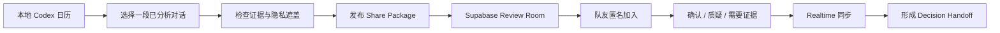
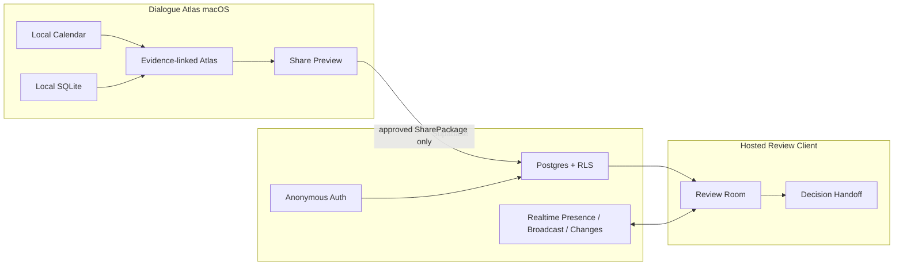

# Dialogue Atlas 黑客松转化方案

> 主方案：Dialogue Atlas Relay · 2026-08-15

## 0. 结论

不建议把当前产品原样包装成“个人 AI 对话可视化工具”，再额外接一个 Supabase 数据库。这样虽然功能真实，但赞助工具很容易显得是后来加上的，团队价值也不够明确。

建议把产品升级为：

> **Dialogue Atlas Relay：把个人与 AI 的长对话，转换成团队可以实时确认、质疑和解决的证据化决策交接室。**

英文一句话：

> **Turn private AI conversations into shared, evidence-backed team decisions.**

它保留当前“本地日历 + 论点星图”的强项，再增加一个非常集中的协作闭环：

1. 用户从本地 Codex 日历选中一段重要对话；
2. Dialogue Atlas 生成或打开已经核验的论点星图；
3. 用户只发布经过确认、遮盖后的图谱与必要证据，不上传原始 JSONL；
4. 团队成员通过链接进入 Supabase Review Room；
5. 大家实时标记“确认 / 质疑 / 需要证据”，查看彼此当前位置并留下短评；
6. 系统最终形成“已确认决定 / 仍有争议 / 下一步行动”的交接结果。

这让 Supabase 成为运行时体验的核心，让 Devin 成为可审计的开发协作者，而不是两个赞助商 logo。

---

## 1. 为什么这个方向最适合当前项目

### 1.1 当前真正缺的不是更多分析，而是交接

现有 Dialogue Atlas 已经能：

- 找到历史 AI 任务；
- 把单段对话转成语义片段、逻辑关系和模式岛；
- 让结构回到逐字证据；
- 允许用户纠正模型。

但这些价值仍停留在个人电脑里。团队成员真正面对的问题是：

> 一个人和 AI 做完了复杂调研或方案讨论，发给队友的往往只是一段长聊天、一个结论或一份没有来龙去脉的文档。队友不知道哪些已经决定、哪些只是 AI 建议、哪些证据不足、哪些结论后来被修正。

“Relay”正好把现有星图从个人复盘工具变成团队交接工具。

### 1.2 比另外两条路线更稳

| 方向 | 优点 | 问题 | 判断 |
|---|---|---|---|
| 个人 AI 工作周报 | 易做，复用日历 | Supabase 容易沦为云存储，现场变化不明显 | 不作为主方案 |
| 跨对话主题聚合 | 长期价值高 | 依赖更多模型分析，当前真实 run 全部为 partial | 暂不做 |
| 团队决策交接室 | 复用现有 Atlas；实时协作清楚；问题具体 | 需要新增分享与 review client | **主方案** |

### 1.3 和评分结构吻合

官方当前评分为：赞助工具活用 25、完成度/实际运行 25、创意 20、问题价值 15、Demo 15。

Relay 的对应关系是：

| 评分项 | 方案中的可见证据 |
|---|---|
| 工具活用 | Supabase Postgres/Auth/RLS/Realtime 是协作房间本身；Devin 有任务→PR→测试→复核记录 |
| 完成度/运行 | 两个浏览器或设备现场同步审阅状态，不依赖口头说明 |
| 创意 | 不是聊天总结，而是把私人 AI 工作转成团队共同确认的决策对象 |
| 问题价值 | 解决 AI 工作被锁在个人聊天中、团队无法复核上下文的问题 |
| Demo | 本地选对话→发布→第二人质疑→第一人解决，三分钟内有明显状态变化 |

---

## 2. 核心用户场景

### 推荐场景：研究或产品方案交接

用户先独自与 Codex 完成一段复杂任务，例如：

- 核对比赛规则并形成执行计划；
- 调研技术架构并选择方案；
- 讨论研究问题、方法和风险；
- 整理需求并反复修改成品。

现在他需要把结果同步给团队。传统做法只有：

- 把整段聊天发出去；
- 自己重新写一份总结；
- 只发最终结论，让队友无法检查依据。

Dialogue Atlas Relay 发布的是一个团队可操作的结构：

- 蓝色锚点：原始问题或任务；
- 关系边：为什么得到某个结论、后来如何修正；
- 逐字证据：结论来自哪一句可见文本；
- Review 状态：谁确认、谁质疑、哪里仍缺证据；
- Handoff：最终决定、未解决问题、下一步负责人。

### 目标用户

- 使用 AI 辅助工作的学生团队、研究小组、产品团队和黑客松团队；
- 由一个人先探索，再需要其他成员快速接手和复核的团队；
- 需要保留依据和修改链，而不能只接受 AI 摘要的任务。

---

## 3. MVP 用户流程



### 发布者

1. 在本地日历打开一段已分析对话；
2. 点击“分享给团队复核”；
3. 看到发布预览：标题、节点数、关系数、证据摘录、将被排除的信息；
4. 确认不上传原始 JSONL、绝对路径、完整 transcript、模型 prompt 和内部 validation 原始对象；
5. 创建 review room，复制链接或二维码。

### 审阅者

1. 打开链接，输入显示名；
2. Supabase Anonymous Auth 创建不需要邮箱的 authenticated user；
3. 通过 room code 加入房间；
4. 点击节点并选择：
   - **确认**：结论可作为团队共同认识；
   - **质疑**：判断或关系需要讨论；
   - **需要证据**：当前证据不足以支持结论；
5. 可写一条短评；
6. 看到其他成员在线状态、当前聚焦节点和审阅更新。

### 发布者解决争议

1. 打开被质疑节点；
2. 查看原始证据摘录和评论；
3. 标为“已解决”或保留“未解决”；
4. 填写最终决定或下一步行动；
5. 生成团队交接视图。

---

## 4. 产品架构



### 4.1 保持本地的内容

- 原始 Codex rollout JSONL；
- 完整可见 transcript；
- source file path；
- 本地 message/event ID；
- 模型 prompt 和完整 stage 原始输出；
- 未经用户确认的 evidence；
- Keychain 中的 provider 凭据。

### 4.2 上传到 Supabase 的内容

只上传用户确认的 `SharePackage`：

```ts
interface SharedAtlasPackage {
  schemaVersion: "relay-v1";
  title: string;
  publishedAt: string;
  units: Array<{
    id: string;
    speaker: "user" | "assistant";
    kind: "anchor" | "card" | "operation" | "unresolved";
    label: string;
    acts: string[];
    modeIds: string[];
    evidenceExcerpt?: string;
  }>;
  relations: Array<{
    id: string;
    source: string;
    target: string;
    type: string;
    evidenceExcerpt?: string;
  }>;
  modes: Array<{ id: string; label: string; color: string }>;
  layout: Record<string, { x: number; y: number }>;
}
```

发布时重新生成 share IDs，避免暴露本地 UUID；绝对路径和未批准文本不得进入 payload。

---

## 5. Supabase 的具体角色

### 5.1 最小数据模型

建议只建四张核心表，避免黑客松期间过度设计：

#### `review_rooms`

- `id`
- `title`
- `owner_id`
- `status`: open / resolved / archived
- `created_at`

#### `room_members`

- `room_id`
- `user_id`
- `display_name`
- `role`: owner / reviewer
- 唯一键 `(room_id, user_id)`

#### `atlas_versions`

- `id`
- `room_id`
- `version`
- `payload jsonb`
- `published_by`
- `created_at`

MVP 不把所有节点和关系拆成云端关系表，直接保存一个不可变、版本化 JSONB snapshot；持久审阅状态单独规范化。

#### `node_reviews`

- `room_id`
- `atlas_version_id`
- `node_id`
- `user_id`
- `stance`: confirm / challenge / needs_evidence
- `note`
- `resolved`
- `resolution_text`
- `updated_at`
- 唯一键 `(atlas_version_id, node_id, user_id)`

### 5.2 Auth

首版使用 Supabase Anonymous Auth：

- 不要求评委或队友输入邮箱；
- 每个浏览器仍有稳定 user ID；
- 可以通过 RLS 区分房主与审阅者；
- 显示名存入 `room_members`。

### 5.3 RLS

公开 schema 的四张表全部开启 RLS：

- 只有成员能读取 room、snapshot 和 reviews；
- 只有 owner 能发布新 atlas version、关闭房间和填写 resolution；
- reviewer 只能 upsert 自己的 review；
- 用户不能修改其他成员的 stance 或显示名；
- service-role key 不进入桌面或网页客户端。

加入房间建议通过一个只接受短期 invite code 的受控 RPC 完成，而不是把表设为 public read。

### 5.4 Realtime

一个房间使用一个 channel：`room:<room_id>`。

- **Presence**：在线成员、显示名、当前聚焦的 node；
- **Broadcast**：点击某节点时让其他人看到轻量 focus 提示；
- **Postgres Changes**：`node_reviews` 的持久化增删改实时同步。

现场 Demo 必须让观众看见两种变化：

1. 第二台设备上线后，第一台出现成员头像；
2. 第二台把一个结论标成“需要证据”，第一台图上的节点立即变色并出现待处理计数。

这两步就是 Supabase 活用最强的现场证据。

### 5.5 不要为了展示而强塞的能力

- 不需要 Vector / RAG；现有问题不是知识检索；
- 不需要把原始 transcript 全量上云；
- 不需要 Edge Function 承担模型分析；
- 不需要 Storage，除非最后确实要保存导出的图片/PDF；
- 不需要做完整账号设置、密码找回或组织管理。

---

## 6. Devin 的具体使用方案

Devin 不应该被放进产品运行架构里。它的价值应体现为：**在有限时间内独立完成边界明确的工程包，并留下可审计的交付链。**

### 6.1 开工前置检查

在派任务前先确认：

1. Devin org 能实际看到目标 GitHub repo；
2. 可以创建 branch / commit / PR；
3. baseline commit 已包含当前 calendar 与 primary filter；
4. 所有任务从同一个 baseline SHA 开始；
5. Devin 不接触本机真实 JSONL、数据库和 Keychain。

此前曾出现“GitHub 已连接，但 enterprise repo permissions 页面没有目标 repo”的状态；开工时必须重新确认，不能把创建了 public repo 当作 Devin 已获得权限。

### 6.2 推荐的三个 Devin 工作包

#### Devin Task 1：Supabase schema 与 RLS

责任范围：

- `supabase/migrations/**`
- `supabase/seed.sql`
- `src/collaboration/database.types.ts`
- policy / migration tests

交付：

- 四张表、约束、index、RLS policies；
- anonymous owner / reviewer 的正向用例；
- 非成员读取、修改他人 review 的拒绝测试；
- migration 可重复执行的说明；
- 一份 PR。

禁止：修改现有 import、analysis、calendar 和 Codex provider。

#### Devin Task 2：Realtime Room Client

责任范围：

- `src/collaboration/supabaseClient.ts`
- `src/collaboration/roomRepository.ts`
- `src/collaboration/realtimeRoom.ts`
- 单元测试

交付：

- anonymous sign-in；
- create/join room；
- publish/load `SharedAtlasPackage`；
- Presence、Broadcast 和 review subscription；
- unsubscribe / reconnect / error state；
- 不含 service-role key；
- 一份 PR。

#### Devin Task 3：双客户端 E2E 与故障修复

责任范围：

- `tests/review-room*.test.tsx`
- `tests/e2e/review-room.spec.ts`
- 只修复测试暴露的协作模块问题

交付：

- 两个独立 browser context 加入同一房间；
- reviewer B 的 stance 在 reviewer A 可见；
- 非成员访问被拒绝；
- 断线重连后持久 review 仍存在；
- `npm test`、Playwright 和 typecheck receipt；
- 一份 PR 或明确的 review-fix commit。

### 6.3 人类团队自己保留的工作

- 产品范围和数据隐私决策；
- `SharedAtlasPackage` 最终字段；
- 现有 Atlas 的发布入口；
- review room 的视觉层级；
- Devin PR 的 code review 和合并；
- 真实两设备 Demo 彩排；
- 最终讲述与提交材料。

### 6.4 如何向评委证明 Devin 活用

不要只说“我们用 Devin 写了代码”。准备一张开发证据页：

| 任务 | Devin 产出 | 人类复核 | 最终证据 |
|---|---|---|---|
| RLS schema | migration + policy tests | 检查权限边界 | PR、测试日志 |
| Realtime client | room adapter + subscription | 两设备实测 | PR、现场同步 |
| E2E QA | multi-context Playwright | 审核失败与修复 | 红→绿测试记录 |

最有说服力的是展示一个 Devin 初版被测试或 review 找出问题、随后修正的过程。这说明团队在“使用 agent 完成交付”，不是无审查地复制生成代码。

---

## 7. 最小开发范围

### 7.1 建议的代码边界

不要临时拆成新的大型 monorepo。复用现有 React/Vite 代码，通过 URL 参数增加一个轻量 web review mode：

```text
supabase/
  migrations/0001_relay_rooms.sql
  seed.sql
src/collaboration/
  types.ts
  sharePackage.ts
  supabaseClient.ts
  roomRepository.ts
  realtimeRoom.ts
  ReviewRoom.tsx
  DecisionHandoff.tsx
src/components/
  ShareAtlasDialog.tsx
tests/
  review-room.test.tsx
  e2e/review-room.spec.ts
```

- Tauri 正常启动仍进入本地 calendar / atlas；
- 托管网页在 `?room=<room_id>` 时只渲染 Review Room；
- Review Room 复用已有节点、边和模式样式，不复用本地 IPC；
- `App.tsx` 只负责入口切换，不把 Supabase 逻辑散落到现有 calendar / analysis 模块；
- `VITE_SUPABASE_URL` 和 anon key 可进入 web build，service-role key 绝不能出现。

### P0：必须完成

1. 将当前工作树提交为可回退 baseline；
2. 准备一段脱敏、已经核验的真实 snapshot；
3. Supabase project、migration、Anonymous Auth、RLS；
4. 从本地 Atlas 生成并发布 `SharedAtlasPackage`；
5. 一个可通过链接打开的 web review view；
6. confirm / challenge / needs evidence 三态；
7. 两个客户端实时同步 review；
8. 在线成员 Presence；
9. 一个稳定的“决策交接”汇总面板；
10. 两设备完整彩排和无网络降级录像。

### P1：做完 P0 再加

- 节点 focus Broadcast；
- owner resolution text；
- 房间二维码；
- 一键复制 handoff Markdown；
- 分享版本更新提醒；
- 只读投影模式。

### 明确不做

- 云同步全部本地日历；
- 多人实时拖动和共同编辑整张图；
- 冲突合并算法；
- 新的跨对话模型分析；
- 完整账号系统；
- 评论线程、@mention、通知中心；
- 在 Supabase 内重新运行 AI；
- 为比赛临时做 Vector/RAG；
- 公开上传真实私人 transcript。

---

## 8. 倒排开发顺序

官方活动页当前显示 8 月 16 日 12:50 为提交截止。按此倒排：

### 第一阶段：先锁定演示基线

- 提交当前 Dialogue Atlas baseline；
- 移开旧的同 bundle-id App；
- 固定一段脱敏真实会话与 snapshot；
- 写好三分钟 Demo 的每一步和预期画面；
- 确认 Devin repo permission。

退出条件：即使后续协作功能失败，现有日历→星图仍有稳定可演示版本。

### 第二阶段：跑通单房间纵向切片

- 创建 Supabase schema/RLS；
- anonymous sign-in；
- 发布一份 fixture/真实已核验 snapshot；
- web client 读取并渲染；
- 写入一个 node review。

退出条件：第二个浏览器能打开房间并留下持久 review。

### 第三阶段：加入实时可见变化

- node review Postgres Changes；
- Presence；
- 图上 review badge / 颜色；
- handoff summary。

退出条件：两个窗口之间有两项肉眼可见的实时变化。

### 第四阶段：可靠性与提交

- 两客户端 Playwright；
- 断网、空房间、无权限、重复点击处理；
- 用固定 seed 重建 Supabase 数据；
- 录制 60–90 秒无网络备用视频；
- 整理 Devin PR / test receipt；
- 准备 title、description、GitHub URL 和架构图。

退出条件：不运行实时模型也能完成完整 Demo。

---

## 9. 三分钟 Demo 脚本

### 0:00–0:25 问题

“我们每个人都在和 AI 完成大量工作，但团队最后收到的通常是一整段聊天，或者一个看不到依据的结论。真正的决定、修正和未解决问题都被埋在个人上下文里。”

### 0:25–0:55 本地历史

- 打开 Dialogue Atlas 月历；
- 选择一段脱敏真实任务；
- 展示它在本地完成索引，原始 JSONL 没有上传云端。

### 0:55–1:25 证据星图

- 打开预生成 Atlas；
- 点一个最终决定，显示逐字证据；
- 点一条“修正”边，说明结论如何变化；
- 明确这是可见消息结构，不是隐藏思维链。

### 1:25–2:20 Supabase 协作

- 点击“分享给团队复核”；
- 第二个设备打开链接，匿名加入；
- 第一台立即显示新成员在线；
- 第二台把一个节点标记为“需要证据”；
- 第一台图上的节点实时变色并出现待处理项；
- 打开 evidence，填写 resolution。

### 2:20–2:45 交接结果

展示三个列表：

- 已确认决定；
- 仍有争议；
- 下一步行动。

### 2:45–3:00 Devin

展示一张简洁证据页：

- Devin 完成的三个工程包；
- PR / diff；
- RLS 与双客户端测试；
- 人类 review 后的修复。

结束句：

> “Dialogue Atlas 不只是帮我回看和 AI 的对话，它把个人 AI 工作变成团队可以共同验证和继续行动的决策资产。”

---

## 10. 风险与降级

| 风险 | 主方案 | 降级 |
|---|---|---|
| 实时模型分析慢或 partial | 主 Demo 使用预生成、人工核验 snapshot | 完全不发起模型请求 |
| Supabase Realtime 临时断线 | review 先写 Postgres，UI 显示 reconnecting | 手动刷新仍能读到持久 review |
| Devin repo 权限未开 | 第一阶段立即检查 | 团队本地实现，诚实说明 Devin 未完成，不伪造活用 |
| Web deploy 失败 | 同一 Vite build 的 review mode | 两个本机 browser context 演示 |
| 真实数据隐私 | 发布 SharePackage 前逐项预览 | 只用完全脱敏 fixture |
| RLS 阻断 Demo | 用 migration + seed 自动重建 | 不关闭 RLS、不改成 public；修正 policy |
| 旧 App / DB 冲突 | 只运行精确 repo bundle | 使用全新 demo data dir |

绝对不要为了现场顺畅临时关闭 RLS、使用 service-role key 放在前端，或上传完整私人 transcript。这会破坏项目最有价值的可信边界。

---

## 11. 可提交的项目文案

### Project title

**Dialogue Atlas Relay**

### Tagline

**From private AI chats to shared, evidence-backed team decisions.**

### Short description

AI-assisted work is often trapped in one person’s chat history. Dialogue Atlas turns a local Codex conversation into an evidence-linked decision graph, then publishes only an approved and redacted snapshot to a Supabase-powered review room. Teammates can confirm, challenge, and request evidence on key nodes in real time, turning a private AI conversation into a shared decision handoff. The original transcript remains local.

### 中文说明

个人与 AI 完成的复杂工作往往被锁在长聊天记录里。Dialogue Atlas 先在本地把 Codex 对话整理成可追溯的论点星图，再只将用户确认和遮盖后的结构发布到 Supabase 协作房间。团队成员可以实时确认、质疑或要求证据，最终形成共同认可的决定、未解决问题和下一步行动；原始对话始终留在本机。

---

## 12. 成功标准

黑客松版本完成，不以“功能列表增加了多少”为标准，而以以下五件事为准：

1. 评委 30 秒内理解“私人 AI 对话无法有效交接给团队”的问题；
2. 本地 Atlas 的一个结论能回到逐字证据；
3. 第二个客户端的审阅操作在第一个客户端实时可见；
4. Supabase RLS 能阻止非成员访问或修改他人 review；
5. Devin 的贡献可以通过任务、PR、测试和人类复核完整复述。

满足这五项，Supabase、Devin、现有 Dialogue Atlas 和最终用户价值才真正连成一个方案。

---

## 13. 参考资料

- [AIAU Craft Day 官方活动页](https://aiau.connpass.com/event/401500/)
- [Supabase Realtime Broadcast](https://supabase.com/docs/guides/realtime/broadcast)
- [Supabase Realtime Presence](https://supabase.com/docs/guides/realtime/presence)
- [Supabase Row Level Security](https://supabase.com/docs/guides/database/postgres/row-level-security)
- [Supabase Anonymous Sign-Ins](https://supabase.com/docs/guides/auth/auth-anonymous)
