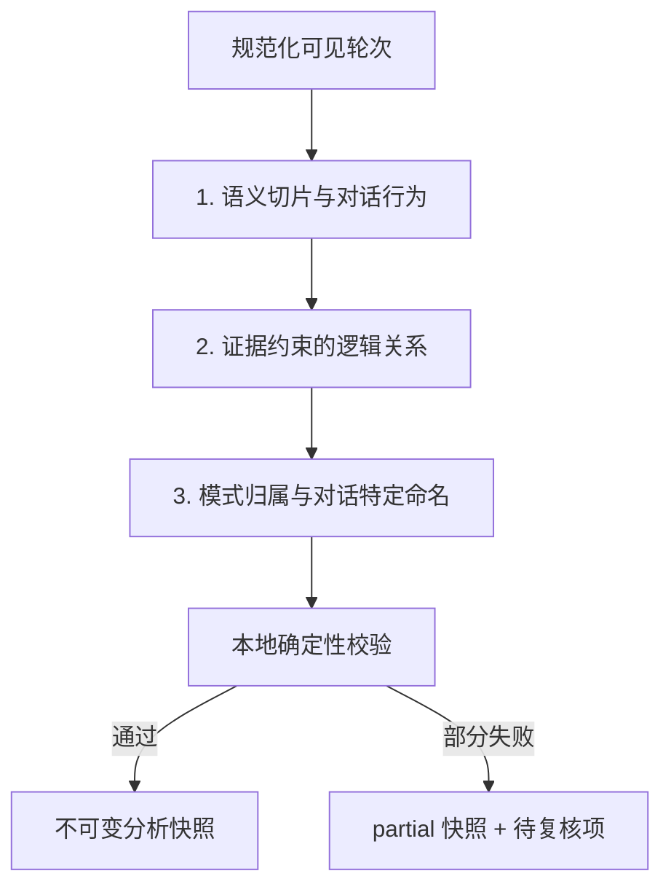
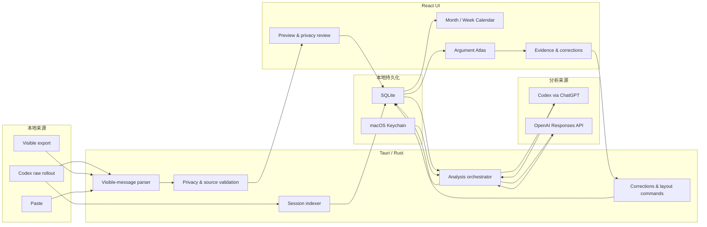

# Dialogue Atlas 项目现状全景

> 黑客松转化前基线 · 2026-08-15 · macOS 当前工作树

## 0. 文档目的与事实边界

这份文档回答四件事：Dialogue Atlas 目前是什么、已经实现了什么、系统如何工作、距离一个可靠的黑客松项目还缺什么。

文中严格区分三类状态：

- **已实现**：当前本机工作树中已有代码，并能通过相应测试或实际运行验证。
- **固定示例**：用于演示视觉和交互的 B5 / calendar fixture，不是实时模型分析结果。
- **尚未实现**：已有设计或开发计划，但当前产品还不能使用。

当前功能以未提交的 working tree 为准，而不是 Git `main` 的 HEAD。日历 v1、主会话过滤、相关迁移和视觉基线仍包含大量未提交及未跟踪文件，因此现在还不是一个可从 Git 精确恢复的发布基线。

Windows 曾做过兼容与内部打包工作，但后续产品推进已明确只聚焦 macOS；本文不把 Windows 作为当前黑客松交付目标。

---

## 1. 项目一句话定义

**Dialogue Atlas 是一个本地优先的 AI 对话资料库：它先把分散在 Codex 历史中的主要任务放回时间轴，再把选中的单段长对话转换成可追溯、可纠正的论点星图。**

它试图解决的不是“如何再做一个聊天界面”，而是三个对话结束后才出现的问题：

1. 过去和 AI 做过哪些重要任务，后来为什么找不到了？
2. 一段长对话中，真正的目标、问题、证据、修正和结论是什么？
3. 模型生成的结构如何回到逐字原文，供用户验证和纠正？

## 2. 当前产品定位

### 2.1 目标用户

当前产品最适合以下单用户、本机工作场景：

- 长期使用 Codex / GPT 完成研究、写作、产品设计和工程任务的人；
- 需要回顾“某段任务是如何形成结论”的研究者、设计者和知识工作者；
- 不满足于对话搜索，希望看到观点关系、修正链和证据出处的人；
- 希望原始会话留在本机，只在确认后发送可见文本或遮盖副本进行分析的人。

### 2.2 当前核心价值

产品已经形成两个互补视角：

| 视角 | 回答的问题 | 当前主要表现 |
|---|---|---|
| 对话日历 | 我什么时候做过什么任务？ | 月视图、周视图、最后活动时间、主要任务过滤、未导入/分析状态 |
| 论点星图 | 这段对话内部是如何推进的？ | 语义片段、对话行为、逻辑关系、模式岛、逐字证据、人工纠正 |

这两个视角构成了当前最有辨识度的产品闭环：**从时间中找到任务，从结构中重新理解任务。**

### 2.3 明确不做的事情

当前版本不是：

- ChatGPT 或 Codex 的替代聊天客户端；
- 隐藏 chain-of-thought、reasoning 或工具调用的查看器；
- Google / Apple / Outlook Calendar 集成；
- 团队协作、云同步、多人知识库或账号系统；
- 自动保证正确的“客观思维图”；
- 以字数、用户/GPT 发言比例或时间长度评价对话质量的统计工具。

星图只分析可观察的 user / assistant 文本。模式岛是 AI 推断的柔性叠层，不声称是自然聚类，也不声称对话一定按整齐阶段推进。

---

## 3. 当前端到端用户流程

实际行为如下：

1. 应用启动后，macOS 后端扫描 `~/.codex/sessions` 与 `archived_sessions`。
2. 日历只展示结构化 metadata 判定为 `primary` 的主要任务；内部 subagent 和无法确认的任务被隐藏，但不会删除。
3. 用户点击未导入任务时，先只看标题、最后活动时间等索引信息。
4. 点击“读取本地预览”后，应用流式提取可见 user / assistant 文本；reasoning、developer、工具、附件和重复事件不进入预览。
5. 用户确认说话者和隐私遮盖后，才创建不可变 conversation 版本并启动分析。
6. 模型分别生成语义片段与行为、逻辑关系、模式归属；本地再验证逐字证据、offset、hash、端点与 membership。
7. 分析成功或部分成功后，用户进入星图，查看节点、边、模式岛和原文证据，并可追加纠正或调整布局。

一个当前很重要的限制是：**没有可用分析 provider 时，用户不能只把对话保存到数据库以后再分析。** 导入与启动分析仍被强耦合。

---

## 4. 已实现功能清单

### 4.1 本机对话日历

- macOS 启动扫描一次，之后支持手动刷新和取消扫描；不实时监听文件系统。
- 扫描原始 `rollout-*.jsonl`，不跟随符号链接。
- 读取 `sessions` 与 `archived_sessions`，同一 session 可追踪 active / archived / missing 状态。
- 最多四个文件并行；未变化文件复用 size / mtime 缓存。
- 当前正在写入的文件发生变化时会重试；仍不稳定时保留旧缓存，不让整批索引失败。
- 使用结构化 `session_meta` 区分：
  - `primary`：主要任务；
  - `internal`：subagent 等内部任务；
  - `unknown`：无法安全分类，默认隐藏。
- 标题会清理开头的 Skill 引用等注入式前缀，避免日历出现 `$visual-product` 或 `The following is ...` 作为任务名。
- 时间固定使用 `Asia/Tokyo`。
- `lastActivityAt` 来自最后一条过滤后的可见消息，不使用文件 mtime、导入时间或 session index 时间伪造。
- `lastCompletedTurnAt` 来自最后一条 assistant final；两者不同则显示结束状态未确认。
- 月视图：周日起始、固定 42 格、每天最多 3 张卡，其余 `+N`。
- 周视图：七日×24 小时、精确分钟圆点、固定高度卡片、45 分钟密集时间簇、东京当前时间线。
- 无权威消息时间的 flat export / paste 进入“日期未知”。
- 详情支持来源状态、分析状态、轮次、活跃日、导入版本和历史版本入口。

### 4.2 导入、预览与版本化

支持三类输入：

1. 原始 Codex rollout JSONL；
2. 带精确 header 的清洗可见消息 export；
3. 用户粘贴的带 speaker 分隔文本。

实现边界：

- 只保留可见 user / assistant 文本；不复制完整原始 JSONL 到数据库。
- commentary 和 final 都是可观察文本；speaker turn 按实际消息顺序归并。
- 工具调用、工具输出、developer 指令、reasoning、重复 event、附件和媒体正文被排除。
- 预览支持修改说话者；提交前重新计算 turn 与时间聚合。
- 预览支持进度、取消、全文件 SHA-256、开始/结束文件签名和末尾不完整行检测。
- 文件在读取或提交前发生变化时，旧预览失效并要求重新读取。
- 同一 `session + SHA` 幂等返回既有 conversation；源会话更新会创建新的不可变版本，不覆盖旧原文、快照、纠正或布局。
- 硬上限为 100 个可见轮次、120,000 字符；分析结果最多 300 个语义单元。超限直接提示拆分，不静默截断。

### 4.3 隐私预览

- 在本地识别 API-key-like 字符串、常见 secret 字段、邮箱和 POSIX 本地路径。
- 用户可选择把遮盖版本发送给分析 provider，同时本地保留原文与 offset 映射。
- 证据界面可以说明模型看到的是遮盖文本。
- API key 不写入 SQLite，保存在 macOS Keychain。
- OpenAI Responses 请求固定 `store:false`、`background:false`。

当前隐私识别只是辅助而非完整 DLP：姓名、电话、自然语言地址等仍可能漏掉；用户也可以关闭遮盖分析。

### 4.4 三阶段对话分析

第一阶段把长回复切成命题级语义单元，并为用户/GPT 发言标注多种对话行为，例如：

- 提问、请求、任务、建议；
- 回答、陈述、解释、举例、论证；
- 评价、同意、质疑、纠正、收窄；
- 假设检验、证据、区分、重新分类、反例、撤回；
- 反馈、承诺、话语管理、其他。

第二阶段生成有方向的关系，例如：

- 回应、支持、理由、举例、条件、对比；
- 质疑、反证、收窄、修正、重新归类；
- 撤回、重新打开、中断后续答、导致、未解决。

第三阶段产生柔性模式，例如目标定位、探索、方案形成、证据核验、质疑校正、决定、执行、协调、元对话和未分类。一个节点可以属于多个模式，同一模式可以形成多个分离小岛。

所有阶段使用严格 JSON Schema。模型输出后，本地验证：

- 逐字 quote 是否确实存在；
- UTF-16 start/end 是否吻合；
- quote hash 是否正确；
- relation 两端是否存在；
- relation 是否有证据；
- mode membership 是否引用有效节点。

失败不会被悄悄补造成正确结果；可确定修复的部分进入 fallback，整次结果标记为 `partial` 并列出待复核项。

### 4.5 分析来源

当前 macOS 支持：

- **Codex via ChatGPT**：默认模型为 `gpt-5.6-luna`，使用用户的 Codex / ChatGPT 登录额度；
- **OpenAI API**：默认模型为 `gpt-5-mini`，API key 存 Keychain。

Codex 路径采用精确版本/hash 白名单、临时 HOME / CODEX_HOME、空 environments、空 MCP/dynamic tools、只读沙箱和外层文件隔离；验证失败时 fail closed，不静默扩大权限或回退到不安全执行。

每个模型请求默认不自动重试，避免重复计费。界面中的“重试失败阶段”当前实际会创建一次新的完整分析，并不是真正从某个 stage 断点续跑。

### 4.6 论点星图

- React Flow 画布，支持平移、缩放、适配全图和 MiniMap。
- ELK.js Web Worker 负责初始关系布局和手动“整理布局”。
- 用户锚点、GPT 卡片、操作节点和未解决节点使用不同视觉角色。
- 节点尺寸由结构重要性决定，不按文字量缩放。
- 关系边有方向、类型和颜色；回返、撤回和重新打开可跨层弯曲。
- 模式岛是可关闭的 SVG 轮廓层，不改变节点位置。
- 默认可见节点上限 120；次级片段可折叠为 `+N`。
- 支持原文搜索、选择后弱化无关内容、查看上下文、线性大纲、模式列表和待复核列表。
- 修改标签或模式不重新排版；拖动节点会 pin，并和 viewport、折叠状态一起保存。

### 4.7 证据与人工纠正

- 每个可用节点和关系都能回到至少一段逐字证据。
- 证据记录包含 message ID、quote、UTF-16 offset、SHA-256 和遮盖映射。
- 用户可修改行为标签、关系类型、模式名称与归属；可新增或删除关系。
- AI 基础快照不可修改，用户操作以 append-only correction event 叠加。
- 可将单项恢复为模型结果。
- 原始消息、说话者、source span 与基础 snapshot 不允许被纠正层改写。

### 4.8 当前前端辅助能力

- 左侧主视图切换：对话日历 / 论点星图。
- 设置页：provider 选择、Codex 登录状态、API key 保存与检测。
- 通用粘贴/JSONL 导入弹窗。
- Calendar streaming preview 弹窗。
- 节点/关系纠正弹窗。
- Evidence、Outline、Modes、Review 四类右侧抽屉。
- 侧栏“筛选”目前只是占位提示；帮助也只是轻量说明，并非完整功能。

---

## 5. 系统架构

### 5.1 技术栈

| 层 | 当前技术 |
|---|---|
| 桌面壳 | Tauri 2.11 |
| 前端 | React 19、TypeScript、Vite 7 |
| 状态 | Zustand |
| 图谱 | React Flow 12、ELK.js Web Worker |
| 后端 | Rust |
| 数据库 | SQLite、SQLx、WAL |
| 模型接口 | OpenAI Responses API、Codex app-server |
| 凭据 | macOS Keychain |
| 测试 | Rust test、Vitest、Playwright |

应用版本目前为 `0.1.0`，bundle id 为 `com.visiontale.dialogueatlas`。默认窗口 1536×1024，允许缩小到 1024×720。

### 5.2 运行架构

### 5.3 前端结构

- `App.tsx`：应用生命周期、日历索引事件、全局弹窗和主视图。
- `store.ts`：snapshot、画布状态、日历日期、选择、抽屉、弹窗和单个分析 progress。
- `src/calendar/`：月/周日历、详情、日期计算、demo calendar、流式预览弹窗。
- `src/components/AtlasCanvas.tsx`：React Flow 图谱与 ELK 布局。
- `EvidenceInspector.tsx`、`Drawers.tsx`、`Modals.tsx`：证据、辅助视图、导入/设置/纠正。
- `ipc.ts`：Tauri 命令与事件适配；浏览器环境改用确定性 fixture。

目前没有 React Router；calendar 与 atlas 是同一应用中的两种主状态，因此切换不会重新挂载整个产品或清空星图布局。

### 5.4 后端结构

- `lib.rs`：Tauri 初始化、SQLite、单实例、窗口聚焦、macOS 启动索引和 25 个 IPC 注册。
- `calendar.rs`：Codex 文件发现、头尾扫描、流式预览、SHA、取消和索引任务。
- `import.rs`：可见消息过滤、speaker turn、时间语义、preview 校验。
- `repository.rs`：SQLite migrations、导入事务、session/version 聚合、snapshot/correction/layout。
- `analysis.rs`：三阶段 prompt、Structured Outputs、fallback 和 validation issues。
- `openai.rs`：Responses API。
- `codex_cli.rs` / `codex_app_server.rs`：Codex readiness、协议、隔离、取消和用量。
- `spans.rs`：隐私遮盖、source span 与 UTF-16 映射。
- `corrections.rs`：纠正事件约束与快照叠加。

### 5.5 SQLite 数据模型

核心表包括：

- `conversations`：一次不可变导入版本；
- `source_messages`：规范化可见消息及发生时间；
- `visible_turns` / `turn_messages`：speaker turn；
- `analysis_runs`：provider、model、stage、状态、用量；
- `analysis_snapshots`：基础 AI 结构及原始 stage 输出；
- `correction_events`：追加式人工纠正；
- `layout_states`：节点位置、pin、折叠、viewport、模式开关；
- `codex_session_index`：只含本机日历索引元数据，不含完整正文；
- `conversation_source_versions`：session + SHA 与 canonical conversation 的版本映射；
- `app_settings`：provider 等非凭据设置。

原始可见消息、canonical source path、模型输出和 snapshot JSON 以明文存入本地 SQLite；当前没有应用层数据库加密、retention、删除或云同步机制。

---

## 6. 固定示例与真实能力的边界

### 6.1 B5 星图

浏览器中常见的 **15 轮 / 41 片段 / 29 展开** B5 是人工固定结构，用于锁定产品视觉契约和交互回归。它证明：

- 设计可以表达锚点、次级片段、回返关系和模式岛；
- 证据、纠正、搜索和布局交互可以测试；
- 1536×1024 的目标界面可以稳定回归。

它不证明实时模型能稳定生成同样质量、数量或关系密度的结果。

### 6.2 浏览器 calendar

`?fixture=calendar` 下的日历条目、历史版本和预览也是确定性演示数据。浏览器模式不会：

- 扫描真实 `~/.codex`；
- 读取 Keychain；
- 保存真实纠正；
- 发起 Codex / OpenAI 分析。

Playwright 当前验证的是浏览器中的 Tauri 替身，不是原生 Tauri 端到端。

---

## 7. 当前真实使用数据快照

以下为 2026-08-15 对开发者本机 SQLite 的只读统计，不是产品基准，也不是模型准确率实验：

| 指标 | 当前值 |
|---|---:|
| 已索引 Codex sessions | 521 |
| primary / internal / unknown | 161 / 360 / 0 |
| 已导入 conversations | 6 |
| 可见 source messages | 256 |
| 可见 turns | 197 |
| analysis snapshots / layouts | 6 / 6 |
| correction events | 0 |
| provider / model | `codex_cli` / `gpt-5.6-luna` |
| 分析状态 | 6 次全部 `partial` |
| 累计 input / output tokens | 72,582 / 37,511 |
| 合计 relations | 62 |
| 合计 validation issues | 125 |

六次真实 snapshot 的结构差异很大：

- 早期三次分别只有 30 / 32 / 32 个语义单元，关系数全部为 0，并各有 32–34 个待复核项；
- 后三次分别产生 39 / 38 / 51 个单元和 26 / 13 / 23 条关系，但仍有 2 / 3 / 20 个待复核项。

这说明两件事：

1. 从真实本地对话到结构化星图的完整链路已经跑通；
2. 分析质量仍明显依赖对话形态、模型输出和协议稳定性，尚不能承诺每段对话都自动得到完整、清晰的图谱。

黑客松叙事应该强调**证据可追溯、partial 诚实暴露、允许人工纠正**，而不是声称模型已经可靠还原用户思维。

---

## 8. 2026-08-15 实际验证结果

本轮重新执行了不会触发模型的验证：

| 验证 | 结果 |
|---|---|
| TypeScript typecheck | 通过 |
| Rust `cargo check --locked --all-targets` | 通过，仍有 dead-code warnings |
| Vitest | 14 files，56 / 56 通过 |
| Rust tests | 83 passed，0 failed，6 ignored |
| Playwright | 13 / 13 通过 |
| Production frontend build | 通过 |
| `git diff --check` | 通过 |
| SQLite `PRAGMA quick_check` | `ok` |

六个 ignored Rust tests 包含：

- 真实 Codex home / sample smoke；
- 已安装 Codex CLI readiness；
- 会产生真实模型用量的 Codex turn smoke。

本轮没有发起真实模型请求或消耗分析额度。

前端 build 的主要未压缩产物约为：ELK worker 1.43 MB、主 JS 494 KB、CSS 53 KB。对本地桌面应用不是当前阻断，但仍有首屏与 worker 加载优化空间。

---

## 9. 当前不足与风险

### 9.1 P0：黑客松演示前必须解决

#### 1. 当前工作树没有形成可回退版本

- `main` 仍有 22 个 tracked changes 和 18 个 untracked files；
- 日历核心迁移、`calendar.rs`、React 日历组件和视觉基线都包含未提交内容；
- 当前约有 3,645 行新增、182 行删除；
- 没有可以代表“当前能运行版本”的 tag。

如果机器、工作树或构建目录出问题，当前功能不能只靠 HEAD 恢复。黑客松开发开始前必须先提交一个完整、可验证的 baseline。

#### 2. 长分析会锁住日历预览弹窗

当前日历导入弹窗把整个七阶段分析都视为一个 `busy`：

- X、Escape、点击遮罩和底部取消都被禁用；
- 全局停止条位于 modal backdrop 下方，最需要时不可点击；
- 完成后会自动把用户拉到星图；
- store 只有单个 progress，不能可靠表示多个分析任务。

“关闭弹窗、后台继续、在日历查看进度、重新打开同一任务、明确停止”已有完整计划，但尚未实现。这是当前最明显的实际 UX 阻断。

#### 3. 实时模型分析不够稳定

当前 6 次真实分析全部为 `partial`。虽然后三次已经能生成较丰富关系，但结果波动明显。台上把实时分析作为唯一主路径会同时暴露：

- 请求耗时；
- provider / 网络不确定性；
- 长时间 modal 锁定；
- 关系数为 0 或待复核项过多；
- 重试会重新运行完整分析并再次产生用量。

黑客松演示需要预生成、人工核验的真实 snapshot 作为主路径；实时分析只能是可放弃的加分项。

#### 4. 演示数据存在隐私泄露风险

正常启动会进入真实本机日历。当前有 161 个主要任务标题，其中可能包含研究、邮箱、文件和个人活动信息。直接投屏真实 `~/.codex` 不合适。

需要使用独立 macOS 用户、脱敏数据库或专用演示来源，并确保演示任务、原文、路径和证据都经过审核。

#### 5. 当前包不能发给评委直接安装

- 现有 DMG 结构完整，SHA-256 为 `38cec181925cddf9b09cefd5482fafc351233d6eb2c918707bb4acde36102f8d`；
- 但 `.app` 的 `codesign --verify --deep --strict` 失败，错误为 `code has no resources but signature indicates they must be present`；
- DMG 被 Gatekeeper 判定为 `no usable signature`，没有 notarization ticket。

它可以在当前没有 quarantine 的开发机上运行，但不能推断评委电脑可以直接打开。当前黑客松交付应按“同机受控演示”设计，除非另行完成正确签名和 notarization。

### 9.2 P1：核心产品质量不足

#### 模型与评价

- 没有一套人工标注 gold conversations 或正式质量指标；
- 没有衡量 segmentation、关系正确性、证据覆盖率和模式可用性的 benchmark；
- B5 是设计 fixture，不是模型成绩；
- validation issue 只能说明结构/证据问题，不能证明语义判断正确；
- 模式仍可能过多、过碎或语义重复；
- 长 GPT 回复切片与操作性 commentary 的主次判断仍可能不稳定。

#### 分析任务生命周期

- job、取消标志、preview cache 和 progress 全在内存；
- WebView reload 或应用退出后不能恢复运行中任务；
- 没有查询当前 active runs 或重放错过事件的 IPC；
- 遗留非终态 run 没有启动时 reconciliation；
- `cancel_analysis(true)` 只表示已请求停止，不表示已经终止；
- terminal event 可能早于 reservation 完全释放，立即重试存在小竞态；
- snapshot 保存与 run 状态更新不是同一事务，崩溃时可能不一致；
- 同一 conversation 单飞，但不同 conversation 没有全局并发上限。

#### 日历体验

- 仅固定 `Asia/Tokyo`；
- 只在启动和手动刷新时扫描，没有 watcher；
- “primary”目前本质上是“不是结构化 subagent”，automation / realtime voice 仍可能进入主要任务；
- 单文件详细 diagnostic 没有完整持久化，UI 只显示 generic partial warning；
- 月视图选中月末日期后切到周视图，anchor 可能仍在月初，跳到错误周；
- 当前时间线不会通过 timer 自动更新；
- 没有真正的任务筛选、项目标签、跨月搜索或主题聚合；
- “日期未知”只能单独查看，无法协助补充/确认源时间。

#### 星图与交互

- 画布中的证据面板、drawer 和底部 legend 会覆盖图，不会自动避让或平移；
- 1536×1024 已较密集，1024×720 没有视觉回归；
- 大量字体只有 7–10px，投影和高缩放环境可读性不足；
- 搜索会遍历 secondary 节点，但默认画布可能未展开它们，出现“有命中数却看不到高亮”；
- 默认 120 个可见节点可控，但超长对话仍可能信息密度过高；
- correction 功能已实现，但当前本机数据库有 0 条 correction event，真实用户使用价值尚未验证；
- 没有适合分享的静态报告、图片、PDF 或只读导出。

#### 无障碍与反馈

- Calendar preview modal 没有完整 focus trap 和背景 inert；
- 通用 dialog 的 inert 范围没有完整覆盖 calendar main；
- 月/周日历缺少完整 `grid / row / gridcell` 语义与方向键导航；
- toast 固定 2.6 秒、不能手动关闭，连续 toast 可能发生 timer 竞争；
- filter / help 入口看似存在，但功能不完整。

### 9.3 P1：数据与安全边界

- SQLite 明文保存可见原文、路径、分析输出和 snapshot；安全假设是可信的本地 OS 账户；
- 没有数据库加密、会话删除、retention 或“清除所有数据”功能；
- KeyStore 有删除实现，但前端没有“清除 API key”的 IPC / UI；
- 隐私遮盖规则范围有限，不是完整个人信息检测；
- renderer 可以向自定义 IPC 提供 JSONL 路径；如果 renderer/XSS 被攻破，路径读取边界仍需进一步收紧；
- OpenAI provider 检测只访问 `/models`，不能证明目标模型、quota、计费和 Structured Output 全链路可用；
- Codex readiness 证明二进制、登录和隔离边界，不等同于真实模型 turn 一定成功。

### 9.4 P1：原生验收与发布工程

- Playwright 全部运行在 browser fixture，不测试真实 Tauri IPC、Keychain、文件选择或模型；
- 缺少自动化的原生冷启动迁移、导入→分析→星图、崩溃恢复和 DMG 安装验收；
- 当前只有 1536×1024 视觉基线，没有 1024×720 和真实投影缩放基线；
- 当前旧 `/Users/visiontale7/Desktop/Dialogue Atlas.app` 与 repo bundle 使用同一 bundle id，旧副本在数据库迁移 v4 后曾出现 SIGABRT；演示时必须移开旧副本，只运行精确 repo bundle；
- 没有 Developer ID 签名、notarization、自动更新或外部分发流程；
- release 版本仍为 `0.1.0`，没有区分构建号或 demo 数据版本。

### 9.5 P2：产品范围尚未形成黑客松闭环

当前产品已经能“找一段对话”和“看一段对话”，但还没有明确证明用户因此完成了什么更高层任务。缺少的价值闭环包括：

- 跨多段对话合并同一项目的演进；
- 自动发现长期未解决问题、反复出现的主题或被推翻的结论；
- 从日历直接生成一周工作回顾、研究决策记录或项目复盘；
- 把人工纠正反馈用于下一次同类分析；
- 便于展示或交付的分享链接、静态报告和导出；
- 对“找回信息所需时间”“复述逻辑准确度”“证据定位速度”等用户价值进行评估。

这些不是底层架构缺失，而是黑客松项目需要选择的**主叙事和胜负手**。

---

## 10. 当前黑客松就绪度判断

### 10.1 已经足够强的部分

- 不是概念稿：真实本地文件、SQLite、模型分析、星图、证据和纠正链路都已存在；
- “日历找任务 + 星图看逻辑”有清楚、直观、适合现场展示的双视图；
- 视觉辨识度高，区别于普通聊天搜索、摘要或知识库；
- 对证据、partial 和人工纠正的诚实处理，有可信 AI 产品特征；
- 本地索引不触发模型，能清楚解释隐私与成本边界；
- 当前前端、Rust、fixture E2E 和 production build 均为绿色。

### 10.2 尚不能直接参赛的原因

当前更准确的判断是：

> **Dialogue Atlas 已经是一个可运行的研究型产品原型，可以作为黑客松项目基底；但它还不是一个可以原样上台的黑客松版本。**

原因不是功能太少，而是：

1. 功能太多但主故事尚未收束；
2. 实时分析质量与耗时不足以支撑唯一主路径；
3. 阻塞式分析 modal 会直接破坏现场体验；
4. 真实日历包含私人任务，缺少安全的演示数据面；
5. 当前构建与 Git 基线还不具备可恢复、可分发条件；
6. 产品还没有用一个可测量场景证明“看完这张图，用户比只翻聊天记录更快、更准地完成了什么”。

### 10.3 三种交付场景的当前状态

| 场景 | 当前判断 |
|---|---|
| 开发者本人 Mac、脱敏数据、预生成 snapshot 的受控现场演示 | 可用，但需先固化 baseline、移开旧 App 并完整彩排 |
| 台上实时运行模型并等待生成完整星图 | 高风险，不应作为唯一演示路径 |
| 把 DMG 直接发给评委安装体验 | 当前不就绪 |

---

## 11. 转成黑客松项目时应保留的核心

无论下一阶段选择哪种题目叙事，以下设计不应轻易丢失：

1. **日历是入口，星图是深入层**：先解决“找不到”，再解决“看不懂”。
2. **只分析可见消息**：不碰隐藏推理，不把工具日志冒充用户思想。
3. **证据优先**：每条重要结构都能回到原文，不只给抽象摘要。
4. **partial 是产品状态**：分析不完整时诚实展示，而不是生成看似顺滑的假图。
5. **人可以纠正模型**：基础快照与用户修订分离，保留来源和责任边界。
6. **本地索引零模型调用**：用户可以先浏览历史，再选择真正值得分析的任务。
7. **结构重要性不等于字数**：用户短问题可以是大锚点，GPT 长解释可以被切成多个次级单元。
8. **模式不是整齐阶段**：允许对话回返、分叉、撤回、重开和多个分离小岛。

---

## 12. 下一阶段需要作出的产品选择

这份文档先完成现状盘点，不在这里提前决定黑客松方案。但下一轮规划必须回答：

1. 评委在 30 秒内要理解的唯一用户痛点是什么？
2. 核心演示是一段对话的“决策复盘”，还是多段对话的“个人 AI 工作记忆”？
3. 哪一段脱敏真实对话最能同时展示修正、证据、回返和未解决问题？
4. 是否完全使用预生成 snapshot，还是保留一个可取消的短实时分析作为加分项？
5. 黑客松新增功能应该补“分析稳定性”，还是补“跨对话产生实际行动/总结”的价值闭环？
6. 用什么可观察指标证明它优于原始聊天记录：定位速度、复述准确度、证据查找时间，还是决策连续性？
7. 最终只在开发者 Mac 上演示，还是必须让评委安装？这会直接决定签名、notarization 和数据打包优先级。

在这些选择明确前，继续横向增加功能会让项目更完整，却不一定让黑客松表达更强。

---

## 13. 当前代码与运行入口

- 项目根目录：`/Users/visiontale7/Desktop/workshop/dialogue-atlas`
- 当前可运行 repo bundle：`src-tauri/target/release/bundle/macos/Dialogue Atlas.app`
- 当前 DMG：`src-tauri/target/release/bundle/dmg/Dialogue Atlas_0.1.0_aarch64.dmg`
- 本机数据库：`~/Library/Application Support/com.visiontale.dialogueatlas/dialogue-atlas.sqlite3`
- B5 固定星图：`src/fixtures/b5.ts`
- 日历前端：`src/calendar/`
- Rust 日历索引：`src-tauri/src/calendar.rs`
- 分析管线：`src-tauri/src/analysis.rs`
- 当前非阻塞分析 UX 计划：`.planning/analysis-background-ux/task_plan.md`

演示时不要启动桌面上的旧 `Dialogue Atlas.app` 副本；它与当前版同 bundle id，但不包含最新数据库迁移，曾在当前数据库环境下崩溃。
