# Dialogue Atlas Relay architecture

Dialogue Atlas Relay turns a private, locally analysed AI conversation into a deliberately smaller collaboration artifact. The product boundary is the publish preview: nothing reaches the room until the owner approves nodes and individual evidence excerpts.

```mermaid
flowchart LR
  A["Codex JSONL on this Mac"] --> B["Tauri import and local analysis"]
  B --> C["SQLite effective snapshot"]
  C --> D["Share preview and item approval"]
  D --> E["RelayPackageV1 allowlist projection"]
  E --> F["Supabase room and immutable atlas version"]
  F <--> G["Relay Web team clients"]
  G --> H["Team nodes, stances, proposals, comments"]
  H --> I["Owner decision and Action Brief"]
  I --> J["Supabase Edge Function"]
  J --> K["Devin Session and GitHub PR"]
  K --> F
```

## Trust boundaries

### macOS companion

The companion is the only component that reads Codex rollouts, stores the visible transcript, runs analysis, resolves evidence spans, applies local corrections, and knows local identifiers. It rebuilds the effective snapshot from SQLite before every share draft.

### Relay package

`RelayPackageV1` is an allowlist DTO rather than a serialized `AtlasSnapshot`. It contains public IDs, labels, graph structure, stable positions, optional approved excerpts, and no local reverse map. The local-to-public ID map remains in SQLite.

### Supabase collaboration projection

Postgres is the durable source for membership, immutable atlas versions, team graph items, stances, proposals, decisions, activity, action briefs, and Devin run receipts. RLS is applied to every exposed table. Realtime Presence and Broadcast carry only ephemeral member/focus/typing/drag metadata; durable mutations are always committed to Postgres first.

### Devin relay

The browser never receives a Devin key and cannot choose an organization or repository. The Edge Function loads an owner-approved Action Brief, applies a fixed canonical repository and resource limit, creates or updates the Session, sanitizes returned event text, and stores an auditable receipt. A PR URL is execution evidence, not proof that CI or human review passed.

## Consistency model

- Immutable source graph per atlas version.
- Team graph and shared layout use revision compare-and-swap.
- Comments, decisions, and activity are append-only.
- Mutations use client IDs for retry idempotency.
- Reconnect reads `activity_events` after the last sequence and refetches changed records.
- Broadcast loss never changes durable truth.

## MVP boundary

Relay supports small structured conversations around an existing reasoning graph. It does not implement free drawing, arbitrary media boards, rich-text CRDT, organization administration, cloud-side conversation analysis, or raw transcript sync.
